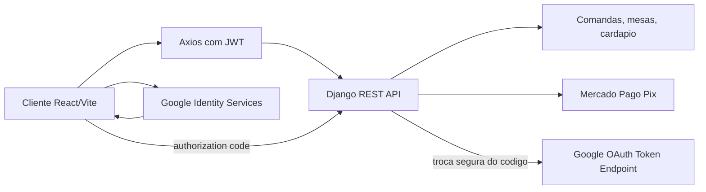

# Redesign Front-End - Pesque & Pague

Este documento resume o redesign aplicado ao front-end React/Vite e os pontos que ainda dependem de configuracao externa.

## O que mudou

- Interface refeita com foco em experiencia de restaurante pesque-pague: hero fotografico, navegacao responsiva, paineis operacionais, cards de cardapio e fluxo de comanda mais claro.
- Design system centralizado em `frontend/src/styles/index.css`, com tokens de cor, foco visivel, alto contraste, fonte ampliada, botoes, formularios, tabs, dialogs, toasts, skeletons e breakpoints.
- Componentes reutilizaveis adicionados: `PageHeader`, `StatusBadge`, `QuantitySelector`, `PasswordField`, `GoogleLoginButton` e `ConfirmDialog`.
- Fluxo do carrinho melhorado com alteracao de quantidade, confirmacao antes de remover/enviar e resumo da comanda.
- Painel da equipe redesenhado com metricas, filtros por status, busca e acoes de avanco da comanda.
- Preparacao para deploy SPA em Netlify (`frontend/public/_redirects`) e Vercel (`frontend/vercel.json`).
- Preparacao visual e tecnica para login Google no front-end, usando o Google Identity Services code flow.

## Arquitetura visual



## Variaveis do front-end

Arquivo: `frontend/.env.example`

```env
VITE_API_URL=http://localhost:8000/api
VITE_GOOGLE_CLIENT_ID=
VITE_GOOGLE_AUTH_ENDPOINT=/auth/google/
```

`VITE_GOOGLE_CLIENT_ID` deve receber o Client ID criado no Google Cloud Console. `VITE_GOOGLE_AUTH_ENDPOINT` aponta para o endpoint do backend que fara a troca segura do authorization code por tokens Google e, depois, retornara os JWTs do sistema.

## Google Login

O botao "Continuar com Google" ja esta pronto no front-end, mas o backend ainda precisa expor o endpoint configurado em `VITE_GOOGLE_AUTH_ENDPOINT`.

Contrato esperado pelo front-end:

```http
POST /api/auth/google/
X-Requested-With: XmlHttpRequest
Content-Type: application/json

{
  "code": "AUTHORIZATION_CODE_DO_GOOGLE",
  "origin": "http://localhost:5173"
}
```

Resposta esperada:

```json
{
  "access": "jwt_de_acesso",
  "refresh": "jwt_de_refresh",
  "user": {
    "id": 1,
    "username": "cliente",
    "email": "cliente@email.com",
    "tipo": "cliente",
    "alto_contraste": false,
    "fonte_grande": false
  }
}
```

## Rodar localmente

Backend:

```bash
cd backend
python -m venv venv
venv\Scripts\activate
pip install -r requirements.txt
python manage.py migrate
python manage.py seed_data
python manage.py runserver 127.0.0.1:8000
```

Front-end:

```bash
cd frontend
npm install
npm run dev
```

URL local testada: `http://127.0.0.1:5173/`.

Usuarios de teste criados pelo seed:

| Usuario | Senha | Perfil |
| --- | --- | --- |
| `cliente` | `pescaria123` | Cliente |
| `garcom` | `pescaria123` | Equipe |
| `gerente` | `pescaria123` | Gerente |

## Build e verificacao

Comando usado:

```bash
cd frontend
npm run build
```

Tambem foram verificados manualmente no navegador:

- Rotas publicas e protegidas.
- Login com usuario local.
- Escolha de mesa, abertura de comanda, busca no cardapio e adicao ao carrinho.
- Carrinho com alteracao de quantidade e dialog de confirmacao.
- Painel da equipe com login de gerente.
- Menu mobile em largura pequena.
- Alto contraste e preferencias de perfil.
- Responsividade de 320px a 1920px sem overflow horizontal.

## Deploy

Para Netlify, o arquivo `frontend/public/_redirects` contem:

```text
/* /index.html 200
```

Para Vercel, o arquivo `frontend/vercel.json` redireciona todas as rotas da SPA para `index.html`.

Antes de publicar, configure:

- `VITE_API_URL` com a URL publica do backend.
- `VITE_GOOGLE_CLIENT_ID` se o login Google for ativado.
- `GOOGLE_CLIENT_ID` e `GOOGLE_CLIENT_SECRET` no backend se o login Google for ativado.
- `CORS_ALLOWED_ORIGINS` no backend com a URL publica do front-end.
- Chaves reais do Mercado Pago no backend se o Pix for usado em producao.

## Referencias usadas

- Inspiracao e padroes de sites premium: https://www.awwwards.com/websites/restaurant/
- Inspiracao e padroes visuais atuais: https://www.cssdesignawards.com/wotd-award-winners
- Google Identity Services, code model: https://developers.google.com/identity/oauth2/web/guides/use-code-model
- Google OAuth para web server apps: https://developers.google.com/identity/protocols/oauth2/web-server
- Diretrizes de marca do botao Google: https://developers.google.com/identity/branding-guidelines
- Netlify SPA redirects: https://docs.netlify.com/manage/routing/redirects/rewrites-proxies/
- Vercel rewrites: https://vercel.com/docs/routing/rewrites
